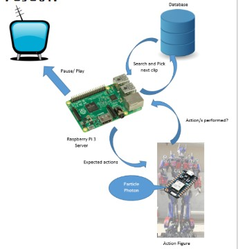

PROJECT MITE (Media Interactive Toy Experience)
============

**University of Pennsylvania, ESE 519: Real Time and Embedded Systems**

* Nichin Sreekantaswamy, Ryan Spicer, Archana Ramachandran
* [Blog](https://devpost.com/software/mite-media-interactive-toy-experience)

### DESCRIPTION AND GOALS
(TODO: Add a brief description of the project and Final Goals)

### VIDEO

### IMAGES and GIFs
Add images and screenshot of your product, user iterface, etc. Animated GIFs of User interfaces would be preferred.

### BUILD INSTRUCTIONS
TODO: Steps to follow for anyone to use this code
