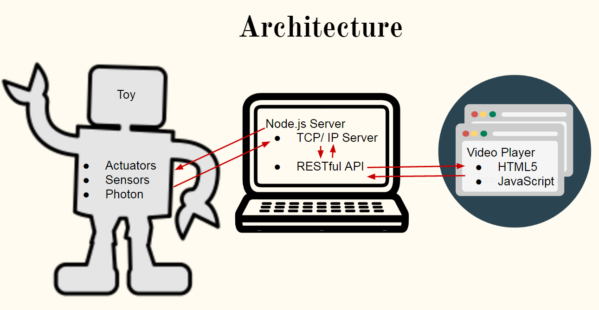

PROJECT MITE (Media Interactive Toy Experience)
============

**University of Pennsylvania, ESE 519: Real Time and Embedded Systems**

* Nichin Sreekantaswamy, Ryan Spicer, Archana Ramachandran
* [Blog](https://devpost.com/software/mite-media-interactive-toy-experience)

### DESCRIPTION AND GOALS
MITE is an interactive toy, cloud service and video player which forms a closed loop system with the media displayed on a television and a robotic action figure. The viewer is required to perform certain actions and actuations with/on the toy in order to potentially decide the sequence of clips that will play on the TV. The toy also will have some form of actuation that occurs corresponding to the content being shown. The viewer gets to decide how an episode will play out and also be more physically involved with their favorite characters. This makes watching television more entertaining and a fun activity, unlike the existing linear playback format.

### VIDEO

### IMAGES and GIFs

### BUILD INSTRUCTIONS
MITE has become an ESE519 lab assignment! Inquire with your nearest ESE519 professor for details!
